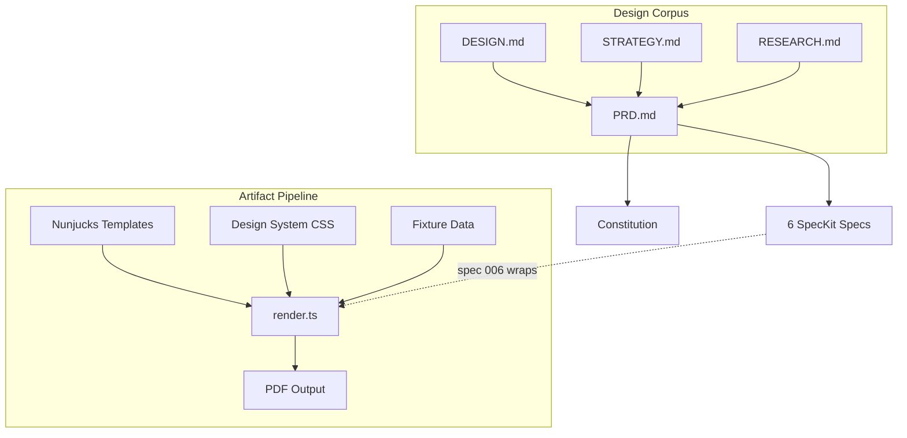

# Ephemera Engine

Unrepeatable parlor games that generate post-game artifacts no one else will ever hold.


## Why

Every game night vanishes. The jokes, the accusations, the confessions — gone by morning. Ephemera Engine turns structured social games into evenings that produce *things*: handbound confession albums, noir case files, sealed letters that arrive a week later. The phone is a candle on the table, not a flashlight in the face.

Four games. Three phases each (preparation, game night, post-game). Procedural generation, curated content libraries, and player-supplied material ensure no two evenings are alike.

## The Four Games

| Game | Mechanic | One-liner |
|------|----------|-----------|
| **The Confession Album** | Chain Q&A with a shrinking board | Victorian parlor tradition meets Proust's questionnaire |
| **Murder Mystery** | AI-generated settings, 3-act dinner party | A speakeasy, a poisoning, six suspects, one evening |
| **Whose Memory?** | Anonymous storytelling + group attribution | Guess who lived it |
| **The Exquisite Corpse** | Collaborative cut-up fiction | Surrealist party game, digitally scaffolded |

## Quick Start

The only runnable code is the artifact rendering pipeline — Nunjucks templates compiled to print-quality PDFs via Puppeteer.

```bash
cd artifacts && npm install

# Render a Confession Album booklet
npm run render:album

# Render a Murder Mystery case file
npm run render:dossier

# Render all 6 templates
npm run render:all

# Type checking
npm run typecheck
```

PDFs output to `artifacts/output/`.

## Architecture



## Documentation

| Document | Description |
|----------|-------------|
| [DESIGN.md](docs/DESIGN.md) | Series framework, four game designs, template system |
| [STRATEGY.md](docs/STRATEGY.md) | Market analysis, architecture, monetization, ritual design theory |
| [RESEARCH.md](docs/RESEARCH.md) | Academic synthesis (~270 citations across 7 domains) |
| [PRD.md](docs/PRD.md) | Full product requirements (~2,700 lines, ~45 screens) |
| [EVALUATION.md](docs/EVALUATION.md) | Full project review, contradiction resolution, scorecard |
| [MANIFEST.md](docs/MANIFEST.md) | Annotated bibliography of all 75 project files |
| [specs/](specs/) | 7 SpecKit specifications decomposing the PRD (incl. 002b-monetization) |
| [memory/constitution.md](memory/constitution.md) | 4 architectural gates every change must pass |

## Project Status

**Phase: Design Complete, Evaluated.** All design documents, the artifact rendering pipeline, 7 implementation specifications, and a full project evaluation are finished. V1 scope: 2 games (Confession Album + Murder Mystery), curated content, no LLM, no IAP.

| Milestone | Status |
|-----------|--------|
| Design corpus (DESIGN, STRATEGY, RESEARCH, PRD) | Done |
| Artifact rendering pipeline (6 templates, CSS design system) | Done |
| SpecKit specifications (7 feature areas, incl. 002b-monetization) | Done |
| Project evaluation & contradiction resolution (8 fixes, 6 gaps filled) | Done |
| Curated murder mystery seeds (5 hand-authored scenarios) | Done |
| GitHub Actions CI (typecheck) | Done |
| Content library authoring (question lineages) | Next |
| Implementation (specs 001→002→005→006→003→004) | Planned |

**Build order:** Auth (001) -> Pre-Game (002) -> Dashboard (005) -> Artifacts (006) -> Confession Album (003) -> Murder Mystery (004)

**Planned stack:** TypeScript 5.x, React Native + Expo, Supabase, Expo SQLite, Claude API, Puppeteer + Nunjucks.

## License

[MIT](LICENSE)
